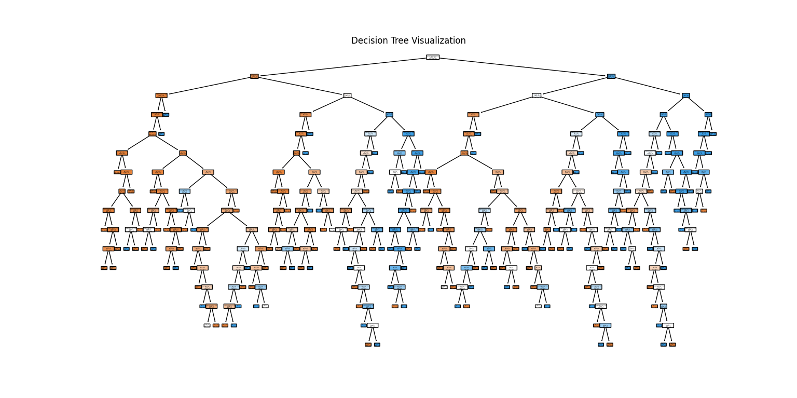
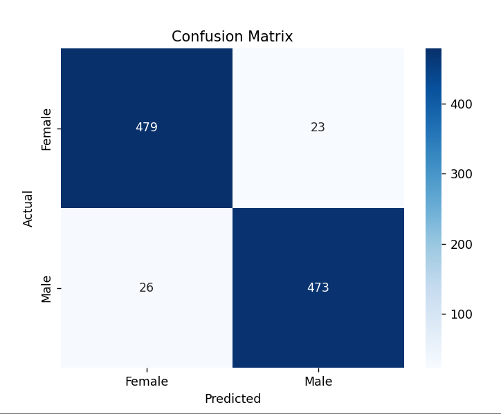
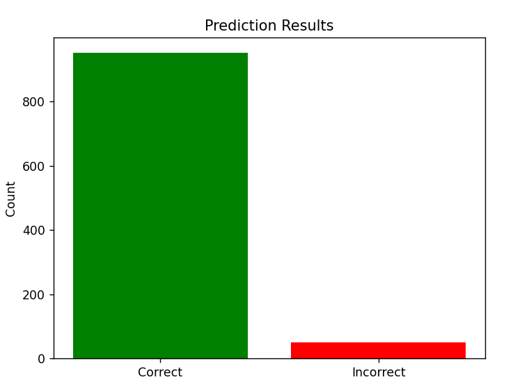

# Gender Classification with Scikit-Learn

This is a simple Python script that demonstrates how to use the `scikit-learn` library to classify gender based on a dataset using a Decision Tree Classifier. It also includes visualizations: a decision tree, a confusion matrix, and a bar chart showing prediction performance.

## 📁 Files

- `gender_classification.csv` – The dataset file
- `gender_classifier.py` – Python script containing the implementation
- `README.md` – This file

## 🛠️ Requirements

Make sure you have the following Python packages installed:

```bash
pip install pandas scikit-learn matplotlib seaborn
```

## 🚀 How to Run

1. Clone or download the repository.
2. Place `gender_classification.csv` in the same directory as `gender_classifier.py`.
3. Run the script:

```bash
python gender_classifier.py
```

## 🧠 What the Script Does

1. Loads the dataset as a pandas DataFrame.
2. Splits the data into features and labels.
3. Splits the data into training and test sets.
4. Trains a Decision Tree classifier.
5. Predicts the labels for the test data.
6. Outputs the classification accuracy.
7. Visualizes the decision tree.
8. Displays a confusion matrix.
9. Shows a bar chart with correct vs. incorrect predictions.

## 📈 Example Output

```
Accuracy: 0.91
```

### 🌳 Decision Tree Visualization

The script displays a full visualization of the trained Decision Tree. This helps you understand:

- How the model splits the data at each node
- Which features are used
- What class each leaf represents

Each node shows:
- The condition used for the split
- The class distribution
- The predicted class

### 🔳 Confusion Matrix

The confusion matrix shows the number of true vs. predicted classifications:

- Diagonal = correct predictions
- Off-diagonal = misclassifications

### 📊 Prediction Bar Chart

This bar chart shows:

- ✅ Green: Number of correct predictions  
- ❌ Red: Number of incorrect predictions  

This gives a visual representation of how well the model performed on the test set.

## 📚 Libraries Used

- [pandas](https://pandas.pydata.org/)
- [scikit-learn](https://scikit-learn.org/)
- [matplotlib](https://matplotlib.org/)
- [seaborn](https://seaborn.pydata.org/)


## Screenshot






