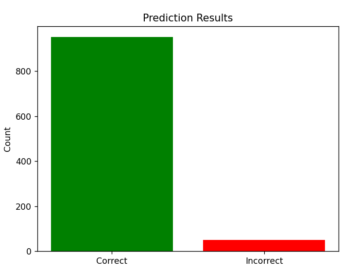

# Gender Classification with Scikit-Learn

This project demonstrates how to classify gender using different machine learning models with the `scikit-learn` library in Python.

## 📂 Available Models

1. [🌳 Decision Tree Classifier](#decision-tree-classifier-)
2. [🧠 MLP Classifier (Neural Network)](#--mlp-classifier)

## 📈 Features

- Loads and prepares data from `gender_classification.csv`
- Compares two classification models
- Displays accuracy, confusion matrix, and prediction results
- Visualizes decision tree structure (for DecisionTreeClassifier)

## 🔁 Bonus

Also included is a script to [compare both models](#-compare-both-models) side by side:
```bash
python compare_models.py
```

It shows:
- Accuracy of both models
- Confusion matrices
- Side-by-side bar chart of prediction performance

---

# Decision Tree Classifier 🌳

This script uses a `DecisionTreeClassifier` from `scikit-learn` to classify gender from the dataset.

## 🛠️ Requirements

```bash
pip install pandas scikit-learn matplotlib seaborn
```

## 🚀 How to Run

```bash
python gender_classifier_tree.py
```

## 🧠 What It Does

- Loads data from `gender_classification.csv`
- Splits into train and test sets
- Trains a Decision Tree model
- Prints accuracy
- Shows:
  - Confusion matrix
  - Bar chart of correct vs. incorrect predictions
  - Full decision tree visualization

## 📈 Example Output

```
Accuracy: 0.92
```

## 📊 Visuals

- Confusion Matrix (Heatmap)
- Bar Chart of Correct vs. Incorrect
- Full Tree Diagram using `plot_tree()`


---

# 🧠  MLP Classifier

## MLP Classifier (Neural Network) 🧠

This script uses `MLPClassifier` (Multi-layer Perceptron) with a `StandardScaler` pipeline to classify gender from the dataset.

## 🛠️ Requirements

```bash
pip install pandas scikit-learn matplotlib seaborn
```

## 🚀 How to Run

```bash
python gender_classifier_mlp.py
```

## 🧠 What It Does

- Loads data from `gender_classification.csv`
- Scales features using `StandardScaler`
- Trains a neural network model
- Prints accuracy
- Shows:
  - Confusion matrix
  - Bar chart of correct vs. incorrect predictions

## ⚙️ Model Details

- One hidden layer with 100 neurons
- Activation: ReLU
- Optimizer: Adam
- Epochs: up to 500

## 📈 Example Output

```
Accuracy: 0.94
```
---

# Compare both models

This is a simple Python script that demonstrates how to use the `scikit-learn` library to classify gender based on a dataset using a Decision Tree Classifier. It also includes visualizations: a decision tree, a confusion matrix, and a bar chart showing prediction performance.

## 📁 Files

- `gender_classification.csv` – The dataset file
- `compare_models.py` – Python script containing the implementation

## 🛠️ Requirements

Make sure you have the following Python packages installed:

```bash
pip install pandas scikit-learn matplotlib seaborn
```

## 🚀 How to Run

1. Clone or download the repository.
2. Place `gender_classification.csv` in the same directory as `compare_models.py`.
3. Run the script:

```bash
python compare_models.py
```

## 🧠 What the Script Does

1. Loads the dataset as a pandas DataFrame.
2. Splits the data into features and labels.
3. Splits the data into training and test sets.
4. Trains a Decision Tree classifier.
5. Predicts the labels for the test data.
6. Outputs the classification accuracy.
7. Visualizes the decision tree.
8. Displays a confusion matrix.
9. Shows a bar chart with correct vs. incorrect predictions.


## 📚 Libraries Used

- [pandas](https://pandas.pydata.org/)
- [scikit-learn](https://scikit-learn.org/)
- [matplotlib](https://matplotlib.org/)
- [seaborn](https://seaborn.pydata.org/)


## Screenshot




